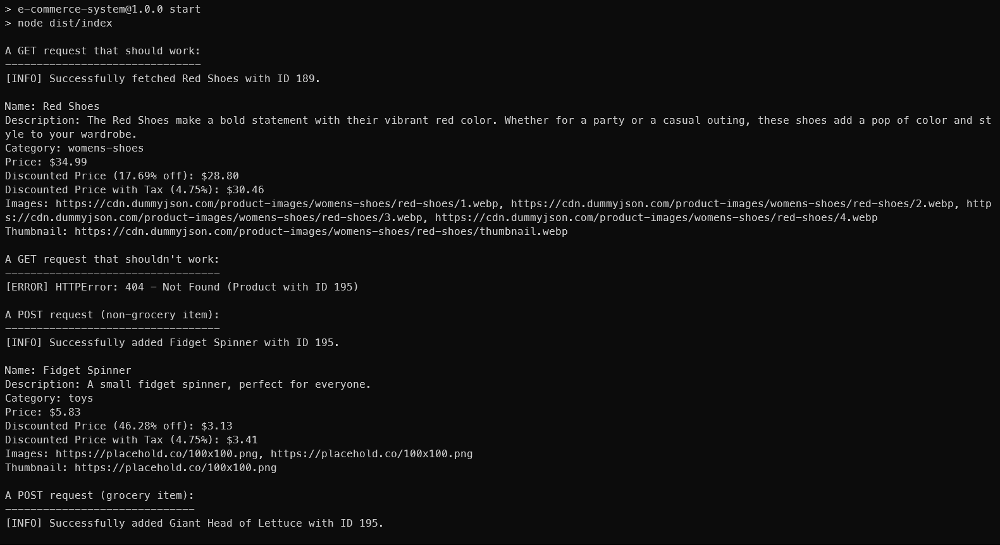

# SBA 5: TypeScript and Advanced JavaScript

[Karl Johnson](https://github.com/hirekarl)  
2025-RTT-30  
<time datetime="2025-07-17">2025-07-17</time>  



## Overview
### Viewer Instructions
In the terminal, run:

```bash
cd e-commerce-system && npm run build && npm run start
```

### Submission Source
Top-level application behavior can be found in [`./e-commerce-system/src/index.ts`](./e-commerce-system/src/index.ts).

### Reflection
Write a reflection of roughly 300 words addressing:
- How you implemented TypeScript features and OOP principles.
- How you handled asynchronous operations and error management.
- The challenges you encountered and how you overcame them.
> I made use of TypeScript type annotations, class definitions (including access modifiers on properties), and the `as const` idiom to enforce type checks. Regarding OOP, I worked with products from the Dummy JSON API as instances of a `Product` class, and I implemented a custom `HTTPError` class that extends `Error` to handle any errors that might get raised from the results of the API calls.
>
> Asynchronous operations were done with the Fetch API, which were used to send `GET`, `POST`, `PUT`, and `DELETE` operations to the API. A `dummyJSONAPIRequest` object handles the `fetch()` calls with methods for all CRUD operations, taking in required inputs and returning `Promise`s that decay to `Product` instances (the API sends objects back that come in via non-`GET` requests). `getProductById`, `addProduct`, `editProduct`, and `deleteProduct` `async` functions wrap the corresponding API calls in `try...catch` blocks to catch and send along errors. `checkResponseStatus` throws a custom `HTTPError` (noting `Response.status` and `Response.statusText` in the error log) when the `Response` from the API call has `Response.ok = false`. In `index.main`, a `GET` request is sent that is expected to come back with an HTTP `404` error (index `195` out of range), and the console logs the resulting error as `"[ERROR] HTTPError: 404 - Not Found (Product with ID 195)"`. Other test cases: a successful `GET` operation, successful `POST`, `PUT`, AND `DELETE` operations with local dummy data (`./src/data/mockProducts.ts`).
> 
> The main challenges were: juggling the syntax of type annotations, especially when defining functions; deciding where to `console.error` the errors; and finding ways to abstract some behavior away when functions became long and messy. Syntax was research; Bryan was helpful during office hours to help me sort out the `console.error` piece; and refactoring a few times helped with abstraction and code organization.

## Assignment
In this assessment, you will apply the skills you’ve developed throughout the TypeScript and Advanced JavaScript module to build a functional, real-world application. This project will test your understanding of TypeScript features, object-oriented programming (OOP) principles, asynchronous operations, error handling, and API interaction. You will have 5.5 hours to complete this assessment.

You will create an E-commerce Product Management System using TypeScript. The final deliverable will include a GitHub repository with your project and a written reflection on your approach and the challenges you faced.
